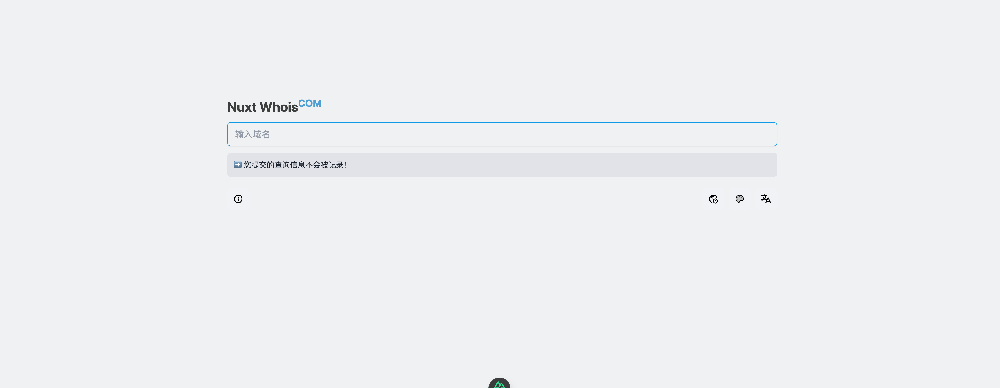

# Nuxt-Whois

Nuxt-Whois 是一个基于 Nuxt3、Tailwind CSS 和 Xep-Whois 构建的Whois查询工具。它提供了一个简洁、响应式的界面，用于查询域名的Whois信息，包括域名所有者、注册状态、到期时间等信息。

## 特性

- **主题切换**：支持深色和浅色模式，可根据用户偏好或系统设置自动切换。
- **语言切换**：提供多语言支持，方便不同语言用户使用。
- **时区切换**：支持时区设置，确保时间信息的准确性。
- **Dns查询**：支持Dns查询，方便用户查看域名的Dns信息。

### 环境要求

- Node.js 18.x 或更高版本
- NPM 或 Yarn

## 图片预览



### 安装

克隆项目到本地：

```bash
git clone https://github.com/7836246/Nuxt-Whois.git
cd Nuxt-Whois

# 使用 PNPM

pnpm install

# 或使用 NPM

npm install

# 或使用 Yarn

yarn
```

### 运行

```bash

# 使用 PNPM

pnpm dev

# Nuxt-Whois
# Nuxt-Whois
# Nuxt-Whois
